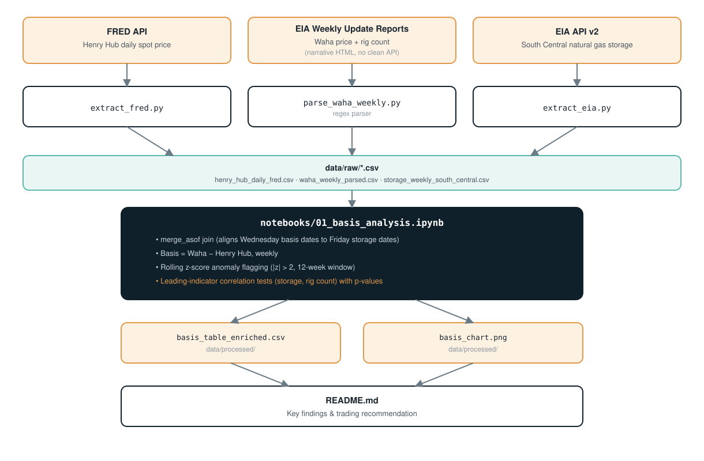
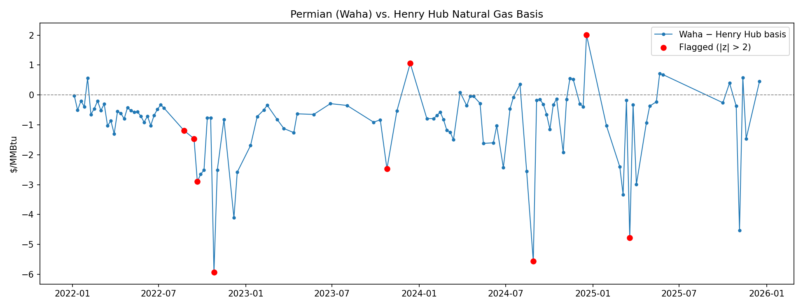

[README.md](https://github.com/user-attachments/files/32882494/README.md)
# Permian–Waha Basis Dashboard & Trade Recommendation

**One-line hook:**
> Waha traded at a $0.91/MMBtu average discount to Henry Hub from 2022–2026, but 9 weeks saw dislocations beyond 2 standard deviations — including a $5.93/MMBtu collapse in October 2022 and a rare premium (+$2.01) in December 2024.

📊 [Presentation deck (PDF)](https://chaunceyjones.github.io/decks/waha-basis-tracker.pdf) ·
🌐 [Portfolio site](https://chaunceyjones.github.io) ·
📁 [All projects](https://github.com/ChaunceyJones/Chaunceys_Portfolio)

## Introduction

Waha (the Permian Basin gas hub) usually trades at a discount to Henry Hub, the U.S. national
benchmark, due to regional pipeline takeaway constraints. This project builds a full pipeline —
from messy, unstructured source data to a statistically-grounded monitoring rule — to answer a
question a trading desk actually cares about: when does that discount widen or reverse far enough
to matter for a decision, rather than just being Waha's normal, everyday behavior?

## Architecture



## Technology Used

- **Python** — extraction, parsing, and analysis
- **Pandas** — data cleaning and joins, including a `merge_asof` join across mismatched report dates (Wednesday basis data vs. Friday storage data)
- **Regex parsing (BeautifulSoup)** — extracting prices directly out of unstructured EIA report prose, since no clean API exists for Waha anywhere
- **FRED API** — current Henry Hub daily prices
- **EIA Open Data API v2** — regional natural gas storage
- **scipy** — hypothesis testing and p-values for the leading-indicator analysis
- **SQL (DuckDB)** — the rolling-window anomaly detection reimplemented as a window function,
  cross-validated against the pandas version (`sql/basis_anomalies.sql`)
- **Jupyter Notebook** — the deeper, human-reviewed analysis
- **Apache Airflow** — weekly scheduled orchestration of the extraction + table-build pipeline

## Dataset Used

| Source | What | Frequency | Notes |
|---|---|---|---|
| **FRED API** (`api.stlouisfed.org`) | Henry Hub spot price (`DHHNGSP`) | Daily | EIA's own v2 route for this **stopped updating in April 2024** — confirmed by inspecting the route directly. FRED mirrors the same underlying data and is still current. |
| **EIA Weekly Update reports** (parsed) | Waha Hub spot price + weekly rig count | Weekly | No clean API exists anywhere for Waha (checked EIA v2 and FRED). EIA states the price in prose each week — parsed with regex in `src/parse_waha_weekly.py`. This is the real "messy data" element of the project. Rig count is parsed from the same pages, reusing the same fetch. |
| **EIA API v2, South Central region** | Natural gas storage | Weekly | `natural-gas/stor/wkly`, filtered to South Central (the region containing Texas) rather than the Lower 48 aggregate. |

Full data-quality caveats (parsing coverage gaps, cross-source methodology differences) are in
[Limitations & assumptions](#limitations--assumptions) below — worth reading before treating any
single number here as precise to the penny.

## Results



- **111 usable weeks** of Waha pricing, spanning 2022–2026
- **9 weeks flagged** as statistically unusual (|z-score| > 2 vs. a trailing 12-week mean)
- Full reproducible analysis: [`notebooks/01_basis_analysis.ipynb`](notebooks/01_basis_analysis.ipynb)
  — if GitHub's preview fails to render it, open it in
  [nbviewer](https://nbviewer.org/github/ChaunceyJones/CJProjects/blob/main/notebooks/01_basis_analysis.ipynb) instead

---

## Business context
You're acting as a junior trading/market analyst supporting a Gas & Power trading desk (modeled on real
Houston-market JDs: Permian Basin / South Texas fundamentals, basis dislocations, trading insight delivery).
The desk needs an early-warning view of when Waha gas prices decouple from Henry Hub far enough to
matter for positioning or pipeline-capacity decisions.

## Methodology
- Basis = Waha price − Henry Hub price, weekly
- Flag basis moves beyond 2 standard deviations of a trailing 12-observation mean
- Correlate basis moves against storage levels and rig activity, testing for both same-week and
  lagged (leading-indicator) relationships

## Key findings
1. **Waha traded below Henry Hub in the large majority of weeks** — median basis of −$0.63/MMBtu
   and a mean of −$0.91/MMBtu across 111 weeks with usable data (2022–2026), consistent with
   known Permian Basin takeaway-capacity constraints.
2. **The distribution has a long negative tail rather than being evenly spread** — the 75th
   percentile basis is still only −$0.30/MMBtu, but the minimum reaches −$5.93/MMBtu. Most
   weeks are a modest, expected discount; a small number are severe dislocations.
3. **9 of 111 weeks (~8%) were flagged as statistically unusual** (|z-score| > 2 vs. a trailing
   12-observation mean), split into two distinct patterns rather than one:
   - **Deep negative dislocations** — Oct 26, 2022 (−$5.93), Aug 28, 2024 (−$5.56), and Mar 19,
     2025 (−$4.78) are the three most severe. These align with the known 2022–2024 period of
     chronic Permian oversupply and pipeline maintenance widely reported by EIA in the same
     period (see raw source commentary in `data/raw/waha_weekly_parsed.csv`).
   - **Two rare positive anomalies** — Dec 13, 2023 (+$1.06/MMBtu) and Dec 18, 2024 (+$2.01/MMBtu,
     the larger of the two) are the only flagged weeks where Waha priced *above* Henry Hub, the
     opposite of its usual discount. The exact EIA report for the December 2024 week
     could not be located to confirm a stated cause. Two pieces of adjacent evidence point toward
     a structural explanation over a weather one: (a) national heating-degree-day data for that
     week was close to normal, not indicative of a demand spike, and (b) EIA's Jan 30, 2025
     report confirms the 2.5 Bcf/d Matterhorn Express Pipeline added new Permian takeaway
     capacity starting October 2024 — weeks before this anomaly — which would structurally
     narrow Waha's discount. This is a plausible, evidence-adjacent hypothesis, not a confirmed
     cause, and should be presented as such rather than asserted.
4. **Storage shows no relationship with the basis** — same-week and lagged (1/2/4/8-week)
   correlations with South Central storage are all statistically non-significant (p > 0.28 in
   every case tested). This is a real, useful negative finding, not an inconclusive one.
5. **Rig count shows a modest, consistent negative relationship** — correlation with the basis
   is roughly −0.24 to −0.29 at lags of 0 to 4 weeks (more rigs associating with a wider/more
   negative basis, consistent with more Permian production pressuring Waha pricing). At face
   value these hit p < 0.05. **However, this doesn't survive correction for the 10 total
   hypotheses tested** (2 variables × 5 lags) — a standard Bonferroni correction requires
   p < 0.005, which none of these reach. Combined with a modest sample size (63-71 weeks,
   limited by partial rig-count coverage), the honest read is: **a plausible, directionally
   consistent hypothesis worth testing on a larger dataset, not a confirmed predictive signal.**
   Reproducible in `notebooks/01_basis_analysis.ipynb`, section 8.
6. Full flagged-week table, basis summary stats, and the enriched storage/rig-count table are
   all reproducible from `notebooks/01_basis_analysis.ipynb` and saved to
   `data/processed/basis_table.csv` and `data/processed/basis_table_enriched.csv`.

## Recommendation
For a trading/commercial desk, the practical signal here is the **flag itself, not the raw
basis level** — a trailing-window z-score catches genuine regime shifts rather than reacting to
Waha's normal, expected discount. Concretely:
- Treat a basis move beyond ~2 standard deviations from the trailing 12-week mean (roughly
  ±$2.15/MMBtu from a −$0.91 baseline, based on this dataset) as a trigger for a manual review
  of regional pipeline/maintenance news before the position is adjusted — not an automatic
  trade signal on its own.
- The rare positive-anomaly case (Dec 2024) coincides with new Permian pipeline capacity
  (Matterhorn Express) coming online in October 2024, which is a stronger candidate explanation
  than weather. If confirmed, this reframes the recommendation: **track pipeline capacity
  additions as a leading indicator for structural basis narrowing**, not just weather for
  short-term demand spikes.
- **Tested, not just proposed:** storage and rig count were joined and checked as candidate
  leading indicators. Storage showed no relationship at any lag — rule it out as a monitoring
  input. Rig count showed a directionally consistent negative correlation (more rigs → wider
  discount) across 0-4 week lags, but doesn't clear a multiple-comparisons-corrected
  significance threshold given the sample size available. Practical takeaway: **don't build a
  trading signal on rig count yet** — it's a reasonable hypothesis for a follow-up analysis
  with more data (either a longer time window, or a source with fuller rig-count coverage than
  the 64% this project's parser achieved), not something to act on today.

## Limitations & assumptions
- **Waha coverage ends January 21, 2026.** EIA discontinued the Natural Gas Weekly Update
  report after that edition, replacing it with a "Weekly Natural Gas Storage Report Supplement"
  on their Beta site, which uses a different structure. All Waha-series analysis in this project
  is scoped to 2022-01-01 through 2026-01-21 as a result.
- **Waha prices are only parsed where EIA chose to write about them.** EIA's Weekly Update only
  includes a specific, parseable price sentence for Waha in weeks where the move was notable
  enough to warrant commentary — quieter weeks simply have no Waha paragraph at all. This is
  confirmed by direct inspection of multiple "no match" weeks against the source, not a parsing
  bug. Result: out of 196 report weeks in range, 111 (~57%) have a usable Waha price, with real
  multi-month gaps in some periods (e.g. summer 2023, summer 2025). Basis conclusions during
  those gap periods should be treated as lower-confidence or excluded rather than interpolated.
- Spot prices ≠ physical delivered cost (transport, fees not included).
- Henry Hub is sourced from FRED (`DHHNGSP`); Waha is regex-parsed prose — the two series come
  from different underlying methodologies (NYMEX close vs. NGI-reported), so basis values are
  directionally reliable but shouldn't be read as penny-precise.
- A denser structured alternative exists but wasn't pursued for this pass: EIA republishes an
  ICE "Wholesale Electricity Market Data" spreadsheet covering seven major hubs, which may
  include Waha as structured (non-prose) data — worth investigating if more density is needed.

## Pipeline
`dags/permian_waha_pipeline_dag.py` orchestrates the weekly refresh: Henry Hub, storage, and Waha
extraction run in parallel, then `src/build_basis_table.py` rebuilds the basis table and chart.
Scheduled for Thursdays, matching EIA's historical weekly release day.

**Known limitation:** the Waha extraction task will currently find no new data on every run.
EIA discontinued the report it depends on after January 21, 2026 (see Limitations below) —
this isn't a bug, it's a real, documented gap. The Henry Hub and storage tasks are unaffected,
since both of those sources are still live. Fixing the Waha task requires migrating the parser
to EIA's replacement report, which hasn't been built yet.

Airflow itself isn't included in `requirements.txt` — see `requirements-airflow.txt` for why
and how to install it separately.

## Repo structure
```
CJProjects/
├── README.md
├── requirements.txt
├── requirements-airflow.txt   # only needed to actually run the DAG
├── .env.example               # copy to .env, add your EIA_API_KEY and FRED_API_KEY
├── src/
│   ├── config.py              # series IDs / route constants
│   ├── extract_eia.py         # pulls storage data from EIA API → data/raw/
│   ├── extract_fred.py        # pulls Henry Hub daily prices from FRED → data/raw/
│   ├── parse_waha_weekly.py   # regex-parses Waha price + rig count from EIA report pages
│   ├── build_basis_table.py   # joins the three sources, computes basis + z-score flags
│   └── run_sql_analysis.py    # runs the SQL version and cross-checks it against pandas
├── sql/
│   └── basis_anomalies.sql    # basis + rolling z-score as a SQL window function
├── dags/
│   └── permian_waha_pipeline_dag.py  # weekly Airflow DAG wrapping the scripts above
├── data/
│   ├── raw/              # untouched pulls (henry_hub, waha_weekly_parsed, storage csvs)
│   └── processed/        # basis_table.csv, basis_table_enriched.csv, chart images
├── images/
│   └── architecture.svg  # pipeline diagram used above
└── notebooks/
    └── 01_basis_analysis.ipynb  # the deeper, human-reviewed analysis (not part of the scheduled run)
```

## Build order (for anyone reproducing this from scratch)
1. Get a free EIA API key and a free FRED API key, add both to `.env` (copy from `.env.example`).
2. Run `python src/extract_fred.py` for current Henry Hub prices.
3. Run `python src/extract_eia.py` for South Central storage (defaults to the right region/process facets).
4. Run `python src/parse_waha_weekly.py --start 2022-01-01 --end 2026-01-21` to build the Waha +
   rig-count series. Check the console output for weeks it couldn't parse, and spot-check a few
   against the source URLs before trusting the data — see Limitations above for why some weeks
   won't match.
5. Open `notebooks/01_basis_analysis.ipynb` and run all cells: joins the three sources, computes
   the basis, flags anomalies, and runs the storage/rig-count leading-indicator tests with proper
   p-values and a multiple-comparisons correction.
6. **Done:** `dags/permian_waha_pipeline_dag.py` wraps steps 2-4 (Henry Hub, storage, and the
   basis table build) into a scheduled weekly Airflow DAG. The Waha extraction step is included
   in the DAG too but currently finds nothing new each run — see the Pipeline section above for
   why. See `requirements-airflow.txt` before trying to run it.
7. Optional cross-check: `python src/run_sql_analysis.py` runs `sql/basis_anomalies.sql` via
   DuckDB — the same basis calculation and rolling z-score anomaly flagging implemented as a
   SQL window function — and reports any disagreement with the pandas output. Two independent
   implementations agreeing is a stronger correctness signal than one looking plausible.
